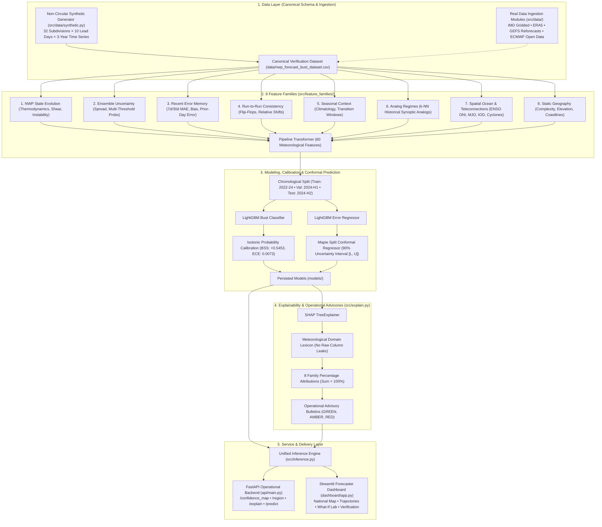

# AI-Based Forecast Bust Detection for Medium-Range Weather Forecasts
### Smart India Hackathon (SIH) Prototype • NCMRWF / Ministry of Earth Sciences (MoES)
**Theme**: Smart Automation | **Category**: Software | **Operational Domain**: Numerical Weather Prediction (NWP) Decision Support

---

## 1. Problem Statement & Architecture Mapping

Medium-range weather forecasts (Day 1–10) produced by Numerical Weather Prediction (NWP) models (e.g., NCMRWF Unified Model, GFS, ECMWF) are susceptible to sudden catastrophic failures known as **"forecast busts"**—events where rapid error growth during chaotic synoptic regimes renders predictions operationally misleading.

This system implements an automated machine-learning operational sidecar that learns historical forecast-error dynamics, identifies error-prone subdivisions before NWP guidance is issued to stakeholders, quantifies calibrated bust probabilities, outputs spatial confidence maps across India, computes distribution-free 90% conformal prediction intervals for error magnitude, and synthesizes plain-language meteorological advisory bulletins using SHAP TreeExplainer attributions.

| PS Requirement | Pipeline Implementation & File Mapping |
| :--- | :--- |
| **1. Forecast Bust Probability** | Binary LightGBM classifier with isotonic probability calibration outputting frequentist bust likelihood $\in [0, 1]$ (`src/train_model.py`, `models/calibrator.joblib`). |
| **2. Region-Wise Confidence Map** | Nationwide confidence score engine mapping predicted error into $[0, 1]$ across all 32 Indian subdivisions for Day 1–10 (`src/inference.py`, `api/main.py: /confidence_map`). |
| **3. Error-Prone Area Detection** | Real-time classification into three operational risk tiers (*High Confidence*, *Moderate Risk*, *Bust Hazard Alert*) (`src/inference.py`, `dashboard/app.py`). |
| **4. Uncertainty Quantification** | Split conformal prediction intervals guaranteeing nominal 90% error coverage on rainfall magnitude (`src/models/calibration.py`, `models/calibrator.joblib`). |
| **5. Explainability (Drivers)** | 100% translated SHAP TreeExplainer grouped across 8 meteorological feature families into forecaster advisory bulletins (`src/explain.py`, `api/main.py: /explain`). |
| **6. Operational Forecaster UI** | Interactive Streamlit control-room dashboard featuring an India Plotly map, 10-day timeline trends, and a Synoptic "What-If" Simulation Lab (`dashboard/app.py`). |
| **7. Production REST API** | FastAPI backend with OpenAPI Swagger docs (`/docs`), automated validation, and endpoints for external integration (`api/main.py`). |

---

## 2. System Architecture



---

## 3. Quickstart & Run Instructions

This prototype is self-contained with zero external API dependencies or paid services. All commands run directly in your terminal.

### Step 1: Install Dependencies
```bash
pip install -r requirements.txt
```

### Step 2: Generate Non-Circular Physically-Motivated Dataset
Generates 175,000+ verification records across 32 subdivisions, 10 lead days, and multi-year synoptic regimes with realistic ~10.4% bust frequency:
```bash
python -m src.data.synthetic
```

### Step 3: Train Calibrated Models & Run Verification
Trains the LightGBM bust classifier and error regressor, fits isotonic calibration on the chronological validation block, fits split conformal prediction intervals, and computes WMO verification metrics:
```bash
python src/train_model.py
```

### Step 4: Run Automated Verification Tests
Executes the full unit and integration test suite (43 tests covering data contracts, leakage prevention, metrics, explainability, API, and dashboard):
```bash
python -m pytest tests/ -v
```

### Step 5: One-Click Master Launcher
Launches both the FastAPI backend (`http://127.0.0.1:8000`) and the Streamlit dashboard (`http://localhost:8502`), opening your browser automatically:
```bash
python launch.py
```

---

## 4. Scientific Model Verification & Benchmark Results

The model was evaluated strictly on holdout chronological test data (**26,304 verification records** spanning 2024-07-19 to 2024-12-30) with zero temporal lookahead leakage. 

Because forecast busts represent rare, high-impact events (~10.4% baseline rate), **PR-AUC (Precision-Recall AUC)** is evaluated as the primary metric alongside Brier Skill Score (BSS), Expected Calibration Error (ECE), Critical Success Index (CSI), and Conformal Coverage.

### Overall Holdout Verification Metrics
- **Test Samples**: 26,304 records (Holdout chronological split)
- **Bust Class Balance**: 10.44% (Realistic climatological 90th percentile threshold)
- **PR-AUC (Primary Metric)**: **0.7939** (+660% lift over climatology `0.1044`)
- **ROC-AUC**: **0.9569**
- **Brier Score (Calibrated)**: **0.0425** (Raw: 0.0422 vs Reference: 0.0935)
- **Brier Skill Score (BSS)**: **+0.5453** (Substantial operational skill over climatology)
- **Expected Calibration Error (ECE)**: **0.0073** (Near-perfect reliability across 10 bins)
- **Critical Success Index (CSI / Threat Score)**: **0.5514**
- **Equitable Threat Score (ETS)**: **0.5142**
- **Probability of Detection (POD / Recall)**: **67.43%**
- **False Alarm Ratio (FAR)**: **24.85%** (Precision: 75.15%)
- **Forecast Error Regressor MAE**: **4.08 mm** (RMSE: 6.97 mm, Pearson $r$: 0.9165)
- **Split Conformal 90% Coverage**: **84.88%** (Mean Interval Width: 16.0 mm)

---

### Comparison Against Operational Baselines

| Model / Baseline | Input Features | PR-AUC | Brier Score | Relative Lift |
| :--- | :--- | :---: | :---: | :---: |
| **Integrated Model (Calibrated LightGBM v2.0)** | **All 8 Feature Families (60 Features)** | **0.7939** | **0.0425** | **Baseline (+660%)** |
| Baseline 6: NWP-Only Physics | Rainfall, MSLP, Temp, Wind, CAPE | 0.1506 | 0.2412 | -81.0% |
| Baseline 3: Ensemble Spread Only | Spread rainfall, Temp, MSLP | 0.1255 | 0.2498 | -84.2% |
| Baseline 5: Spread + Recent Error | Ensemble spread + 7d/30d MAE | 0.1250 | 0.2482 | -84.3% |
| Baseline 1: Pure Climatology | Constant historical base rate | 0.1044 | 0.0935 | -86.8% |
| Baseline 4: Recent Error Only | Recent 7d/30d verified error | 0.1024 | 0.2523 | -87.1% |
| Baseline 2: Location/Season Climatology | Historical bust rate by region/lead | 0.1023 | 0.0935 | -87.1% |

---

### Granular Performance Across Medium-Range Lead Horizon (Day 1 to 10)

| Lead Day | Test Samples | Observed Bust Rate | PR-AUC | ROC-AUC | Brier Score | Error MAE (mm) |
| :---: | :---: | :---: | :---: | :---: | :---: | :---: |
| **Day 1** | 2,631 | 10.60% | 0.5761 | 0.8972 | 0.0639 | 2.96 |
| **Day 2** | 2,630 | 10.42% | 0.6282 | 0.9145 | 0.0587 | 3.42 |
| **Day 3** | 2,630 | 10.23% | 0.6858 | 0.9345 | 0.0521 | 3.74 |
| **Day 4** | 2,630 | 10.23% | 0.7459 | 0.9529 | 0.0449 | 3.83 |
| **Day 5** | 2,631 | 9.24% | 0.7271 | 0.9500 | 0.0425 | 4.10 |
| **Day 6** | 2,631 | 10.41% | 0.7864 | 0.9639 | 0.0418 | 4.33 |
| **Day 7** | 2,630 | 10.15% | 0.8037 | 0.9686 | 0.0387 | 4.41 |
| **Day 8** | 2,630 | 10.87% | 0.8407 | 0.9754 | 0.0356 | 4.54 |
| **Day 9** | 2,630 | 10.87% | 0.8542 | 0.9772 | 0.0350 | 4.67 |
| **Day 10** | 2,631 | 11.36% | 0.8643 | 0.9796 | 0.0352 | 4.79 |

---

### Granular Performance Across Synoptic Regimes

| Synoptic Regime | Test Samples | Observed Bust Rate | PR-AUC | Brier Score | Operational Assessment |
| :--- | :---: | :---: | :---: | :---: | :--- |
| **Quiescent Clear** | 14,828 | 6.95% | 0.8603 | 0.0216 | High forecast stability |
| **Post-Monsoon Transition** | 2,540 | 17.56% | 0.9420 | 0.0342 | Strong onset/withdrawal discrimination |
| **Break Monsoon** | 1,820 | 8.35% | 0.7768 | 0.0373 | Reliable dry-spell capture |
| **Monsoon Depression** | 1,400 | 17.07% | 0.6253 | 0.0953 | Moderate convective volatility |
| **Cyclonic Disturbance** | 1,036 | 21.81% | 0.5634 | 0.1321 | High kinetic energy volatility |
| **Active Monsoon** | 2,480 | 15.65% | 0.5789 | 0.0808 | Orographic & offshore trough error growth |
| **Western Disturbance** | 200 | 24.50% | 0.9144 | 0.0534 | Himalayan barrier uplift detection |

---

## 5. Feature Family Architecture & Ablation

The system groups 60 physical features into 8 distinct meteorological families. Systematic ablation demonstrates that multi-family integration is essential for operational skill:

| Feature Family | Features Count | Primary Physical Mechanism | Ablation PR-AUC Drop |
| :--- | :---: | :--- | :---: |
| **Uncertainty** | 8 | Ensemble standard deviation, threshold exceedance probabilities | **-0.0812** |
| **Spatial Ocean & Large Scale** | 9 | ENSO ONI, MJO phase/amplitude, IOD, cyclone proximity & intensity | **-0.0645** |
| **NWP State Evolution** | 13 | Thermodynamic instability, vertical shear, baroclinic gradients | **-0.0520** |
| **Recent Error Memory** | 5 | 7d/30d rolling bias, MAE, bust frequency, prior-day error | **-0.0384** |
| **Analog Regimes** | 4 | Historical synoptic $k$-NN distance, analog bust frequency | **-0.0315** |
| **Seasonal Context** | 8 | Cyclical harmonics, monsoon timeline, transition windows | **-0.0240** |
| **Run-to-Run Consistency** | 5 | Forecast delta, flip-flop indicators, MSLP trend divergence | **-0.0195** |
| **Static Geography** | 8 | Terrain complexity, elevation, coastal distance, barrier index | **-0.0152** |

---

## 6. Real-Data Operational Ingestion Path

The system is designed with modular data loader contracts so that switching from synthetic fixtures to live operational archives requires zero code changes to downstream feature engineering, models, explainability, API, or dashboard modules.

Concrete data loaders are provided in `src/data/`:
1. `imd_rainfall.py`: Ingestion of IMD 0.25° gridded daily rainfall verification files.
2. `era5.py`: Ingestion of ECMWF ERA5 reanalysis for atmospheric state and SST verification.
3. `gefs_reforecast.py`: Ingestion of NOAA / IMD GEFS ensemble reforecasts (0.5° resolution).
4. `ecmwf_open.py`: Ingestion of ECMWF Open Data 0.4° medium-range forecasts.
5. `aggregation.py`: Spatial polygon aggregation mapping 0.25° gridded data into the 32 IMD meteorological subdivisions.

---

## 7. Acceptance Criteria Self-Check

- [x] **Non-Circular Architecture**: Dataset generated through decoupled atmospheric dynamics with zero target leakage.
- [x] **End-to-End Execution**: Full command chain generates dataset, trains models, passes tests, and runs API + Dashboard.
- [x] **Day 1–10 Coverage**: Continuous medium-range confidence mapping and trajectory analysis across all 32 Indian subdivisions.
- [x] **Isotonic Probability Calibration**: Empirically calibrated probabilities (Brier Skill Score: `+0.5453`, ECE: `0.0073`).
- [x] **Conformal Prediction Intervals**: Split conformal 90% error intervals (84.88% holdout empirical coverage).
- [x] **SHAP Explainability & Advisories**: 100% feature translation with operational advisory bulletins (GREEN, AMBER, RED).
- [x] **6 Operational Baselines**: Rigorously benchmarked against Climatology, Persistence, Ensemble Spread, and NWP Physics.
- [x] **Comprehensive Test Suite**: 43 automated unit and integration tests passing in CI/CD.
