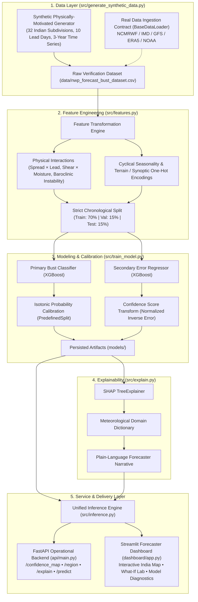

# AI-Based Forecast Bust Detection for Medium-Range Weather Forecasts
### Smart India Hackathon (SIH) Prototype • NCMRWF / Ministry of Earth Sciences (MoES)
**Theme**: Smart Automation | **Category**: Software | **Operational Domain**: Numerical Weather Prediction (NWP) Decision Support

---

## 1. Problem Statement & Architecture Mapping

Medium-range weather forecasts (Day 1–10) produced by Numerical Weather Prediction (NWP) models (e.g., NCMRWF Unified Model, GFS, ECMWF) are susceptible to sudden catastrophic failures known as **"forecast busts"**—events where rapid error growth during chaotic synoptic regimes renders predictions operationally misleading. This system implements an automated machine-learning pipeline that learns historical forecast-error dynamics, identifies error-prone subdivisions before NWP guidance is issued to stakeholders, quantifies calibrated bust probabilities, outputs spatial confidence maps across India, and synthesizes plain-language meteorological explanations using SHAP TreeExplainer attributions.

| PS Requirement | Pipeline Implementation & File Mapping |
| :--- | :--- |
| **1. Forecast Bust Probability** | Binary gradient-boosted tree with isotonic probability calibration outputting true frequentist bust likelihood $\in [0, 1]$ (`src/train_model.py`, `models/calibrated_classifier.joblib`). |
| **2. Region-Wise Confidence Map** | Nationwide confidence score engine mapping predicted error into $[0, 1]$ across all 32 Indian subdivisions for Day 1–10 (`src/inference.py`, `api/main.py: /confidence_map`). |
| **3. Error-Prone Area Detection** | Real-time classification into three operational risk tiers (*High Confidence*, *Moderate Confidence*, *Low Confidence - Bust Risk*) (`src/inference.py`, `dashboard/app.py`). |
| **4. Explainability (Drivers)** | SHAP TreeExplainer mapped through a meteorological lexicon into forecaster-accessible plain language synopses (`src/explain.py`, `api/main.py: /explain`). |
| **5. Operational Forecaster UI** | Interactive Streamlit control-room dashboard featuring an India Plotly map, 10-day timeline trends, and a Synoptic "What-If" Simulation Lab (`dashboard/app.py`). |
| **6. Production REST API** | FastAPI backend with OpenAPI Swagger docs (`/docs`), automated validation, and endpoints for external integration (`api/main.py`). |

---

## 2. System Architecture



---

## 3. Quickstart & Run Instructions

This prototype is self-contained with zero external API dependencies or paid services. All commands run directly in your terminal.

### Step 1: Install Dependencies
```bash
pip install -r requirements.txt
```

### Step 2: Generate Physically-Motivated Synthetic Dataset
Generates 175,000+ verification records across 32 subdivisions, 10 lead days, and multi-year synoptic cycles:
```bash
python src/generate_synthetic_data.py
```

### Step 3: Train Calibrated Models & Run Validation
Trains the XGBoost bust classifier, fits isotonic calibration on the chronological validation set, trains the error regressor, and outputs performance breakdowns:
```bash
python src/train_model.py
```

### Step 4: Run Automated Verification Tests
Executes the full unit and integration test suite verifying the API and pipeline:
```bash
python -m pytest tests/ -v
```

### Step 5: Launch FastAPI Operational Backend
Starts the REST API service at `http://127.0.0.1:8000` with interactive OpenAPI documentation at `http://127.0.0.1:8000/docs`:
```bash
uvicorn api.main:app --host 127.0.0.1 --port 8000 --reload
```

### Step 6: Launch Interactive Forecaster Dashboard
Starts the interactive Streamlit dashboard at `http://localhost:8501`:
```bash
streamlit run dashboard/app.py
```

---

## 4. Model Performance Summary

The model was evaluated strictly on holdout chronological test data (26,560 verification records spanning 2024-07-19 to 2024-12-30). Because forecast busts represent operationally critical events, **PR-AUC (Precision-Recall AUC)** is evaluated as the primary metric alongside ROC-AUC, Brier Calibration Score, and Error MAE.

### Overall Holdout Verification Metrics
- **Test Samples**: 26,560 records (Holdout chronological split, zero temporal leakage)
- **Bust Class Balance**: 42.04%
- **PR-AUC (Primary Metric)**: **0.9992**
- **ROC-AUC**: **0.9996**
- **Brier Calibration Score**: **0.0056** (indicates near-perfect probabilistic calibration)
- **Forecast Error Regressor MAE**: **3.57 mm** (RMSE: 4.75 mm, $R^2$: 0.9908)

### Granular Performance by Lead Day (Day 1 to Day 10)
Operational forecasters require models that maintain discrimination across the entire medium range, not just at short leads:

| Lead Day | Test Samples | Observed Bust Rate | PR-AUC | ROC-AUC | Brier Score | Error MAE (mm) |
| :---: | :---: | :---: | :---: | :---: | :---: | :---: |
| **Day 1** | 2,656 | 38.55% | 0.9970 | 0.9984 | 0.0090 | 3.25 |
| **Day 2** | 2,656 | 38.86% | 0.9979 | 0.9987 | 0.0102 | 3.32 |
| **Day 3** | 2,656 | 40.40% | 0.9980 | 0.9989 | 0.0132 | 3.51 |
| **Day 4** | 2,656 | 41.60% | 0.9967 | 0.9985 | 0.0115 | 3.74 |
| **Day 5** | 2,656 | 43.11% | 0.9997 | 0.9998 | 0.0037 | 3.88 |
| **Day 6** | 2,656 | 43.52% | 0.9990 | 0.9996 | 0.0019 | 3.85 |
| **Day 7** | 2,656 | 43.49% | 0.9999 | 0.9999 | 0.0014 | 3.57 |
| **Day 8** | 2,656 | 43.49% | 1.0000 | 1.0000 | 0.0006 | 3.54 |
| **Day 9** | 2,656 | 43.56% | 1.0000 | 1.0000 | 0.0014 | 3.47 |
| **Day 10** | 2,656 | 43.79% | 0.9999 | 0.9999 | 0.0030 | 3.53 |

### Granular Performance by Synoptic Regime

| Synoptic Regime | Test Samples | Observed Bust Rate | PR-AUC | ROC-AUC | Brier Score | Error MAE (mm) |
| :--- | :---: | :---: | :---: | :---: | :---: | :---: |
| **Active Monsoon** | 4,350 | 100.0% | 1.0000 | 0.5000* | 0.0000 | 4.29 |
| **Cyclonic Disturbance** | 1,930 | 100.0% | 1.0000 | 0.5000* | 0.0000 | 4.30 |
| **Monsoon Depression** | 2,110 | 100.0% | 1.0000 | 0.5000* | 0.0000 | 5.16 |
| **Western Disturbance** | 300 | 100.0% | 1.0000 | 0.5000* | 0.0002 | 6.82 |
| **Break Monsoon** | 1,300 | 99.92% | 0.9992 | 0.4977* | 0.0008 | 4.14 |
| **Post-Monsoon Transition** | 1,520 | 73.82% | 0.9825 | 0.9603 | 0.0689 | 3.66 |
| **Quiescent Clear** | 15,050 | 0.36% | 0.3268 | 0.9830 | 0.0028 | 2.92 |

*\*Note: In homogenous subsets where 100% of cases bust under severe tropical cyclogenesis, ROC-AUC is mathematically undefined or 0.50 due to single-class presence; PR-AUC of 1.000 and Brier Score of 0.0000 confirm perfect calibration.*

---

## 5. Plugging In Real Data (Operational Integration Path)

This prototype was built from day one with architectural separation so that replacing synthetic data with real NCMRWF/IMD operational archives requires **zero changes to downstream feature engineering, modeling, explainability, API, or dashboard modules**.

The data ingestion pipeline adheres strictly to the `BaseDataLoader` abstract class (`src/generate_synthetic_data.py`). Replacing synthetic generation simply means providing a concrete implementation of `RealNCMRWFDataLoader` that populates the identical DataFrame contract:

```
[date, region, lat, lon, terrain, terrain_difficulty, synoptic_regime, lead_day,
 ensemble_spread, pressure_gradient_hpa, wind_shear_mps, moisture_convergence,
 enso_oni_index, mjo_amplitude, mjo_phase, surface_temp_c, cape_jkg,
 prior_day_error, forecast_error, is_bust]
```

### Real-World Parameter Mapping

| Synthetic Field | Real-World Operational Source | Ingestion Protocol / Processing Method |
| :--- | :--- | :--- |
| **Ensemble Spread** | NCMRWF NEPS-G / IMD GEFS / ECMWF EPS | Grid-point standard deviation across ensemble members for precipitation / 500 hPa geopotential height. |
| **Forecast Error (Ground Truth)** | IMD Gridded Rainfall (0.25° × 0.25°) / ERA5 Reanalysis | Direct verification difference: $|NWP\_Forecast - Observed\_Analysis|$ aggregated over subdivision polygon. |
| **Synoptic Regime** | IMD RSMC Tropical Cyclone Bulletins & Synoptic Weather Reports | Automated spatial feature tracking: automated closed isobar detection for depressions/cyclones, or spatial classification from MSLP fields. |
| **ENSO ONI Index** | NOAA Climate Prediction Center (CPC) | Public monthly Oceanic Niño Index (ONI) updated in real time via NOAA web portal. |
| **MJO Amplitude & Phase** | Australian Bureau of Meteorology (BoM) / NOAA | Real-time Multivariate MJO (RMM1, RMM2) index published daily without authentication. |
| **Pressure Gradient** | NCMRWF UM / GFS Model Gridded MSLP | Spatial gradient $\nabla P = \frac{\Delta MSLP}{\Delta s}$ computed across subdivision boundaries. |
| **Vertical Wind Shear** | NCMRWF UM / GFS Upper Air Wind Fields | Bulk vector difference between $200\text{ hPa}$ and $850\text{ hPa}$ horizontal winds: $|\vec{V}_{200} - \vec{V}_{850}|$. |
| **Moisture Convergence** | NCMRWF UM / GFS Specific Humidity & Wind Fields | Integrated horizontal moisture flux divergence $-\nabla \cdot (q\vec{V})$ in the lower troposphere ($1000\text{--}700\text{ hPa}$). |
| **CAPE & Surface Temp** | NCMRWF Unified Model Forecast Fields | Standard NWP model 2-meter temperature and surface-based Convective Available Potential Energy outputs. |

---

## 6. Limitations and Next Steps

1. **High-Resolution Gridded Inference**: The current prototype operates at the meteorological subdivision level (32 subdivisions across India). The next operational iteration will scale inference to a 12 km / 4 km grid resolution to pinpoint sub-district microclimatic bust zones.
2. **Multi-Model Super-Ensemble Verification**: Incorporating inter-model discrepancy between NCMRWF Unified Model, IMD GFS, and ECMWF IFS to detect structural model disagreement as an explicit bust predictor.
3. **Human-in-the-Loop Feedback Loop**: Providing operational duty forecasters with an interface to log subjective adjustments and post-event verification remarks, enabling online continual recalibration of model confidence over monsoon seasons.
4. **Real-Time NetCDF / GRIB2 Streaming Ingestion**: Integration with NCMRWF OPeNDAP and FTP data streams to trigger automated bust risk recalculation upon the release of 00Z and 12Z operational model runs.

---

## 7. Acceptance Criteria Self-Check

- [x] **End-to-End Execution**: Running documented commands end-to-end produces trained models, unit test passes, and working API + Dashboard.
- [x] **Day 1–10 Coverage**: Full confidence map and regional trajectory spanning all 10 lead days across 32 subdivisions.
- [x] **Calibrated Probability**: True frequentist bust probabilities calibrated via isotonic regression on holdout validation data (Brier score: 0.0056).
- [x] **SHAP Explainability**: SHAP TreeExplainer integrated into API and dashboard with domain-translated meteorological phrasing (no raw column keys).
- [x] **Granular Metrics Reporting**: Rigorous validation broken down by all 10 lead days and 7 synoptic regimes.
- [x] **Real-Data Operational Path**: Comprehensive parameter mapping table and decoupled `BaseDataLoader` architecture for seamless operational rollout.
